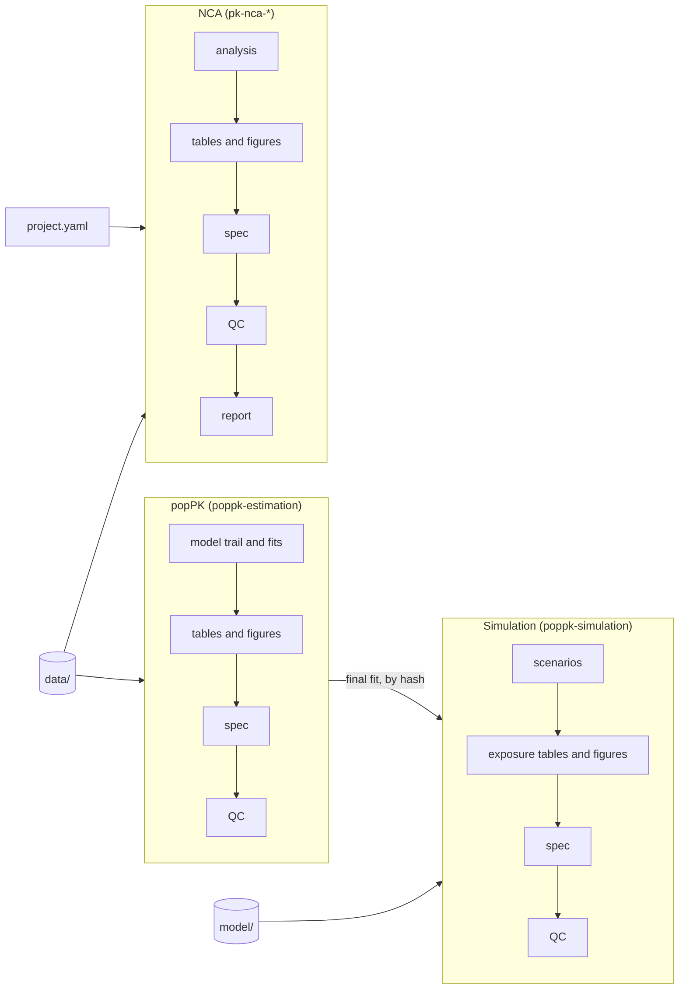

# Documentation

Guides for using this template. Start with the [project README](../README.md) for setup,
then pick a workflow.

| Guide | Covers |
|---|---|
| [PopPK workflow](poppk/README.md) | Population PK end to end: model trail with the nlmixr2save fit cache, diagnostics per checklist, tfrmt tables, provenance and QC; then simulation from a fit, a model file or a shared fit archive. Includes diagrams and scenario prompts. |
| [NCA workflow](pk-nca/README.md) | Noncompartmental analysis end to end, from `project.yaml` through PKNCA, tables and figures, provenance, QC and the Quarto report. Includes skill and workflow diagrams and scenario prompts. |
| [Skill pages](skills/README.md) | One page per skill: purpose, when it is used, outputs, how to use it, main functions, rules and troubleshooting |
| [Skills overview](../.posit/assistant/skills/README.md) | The skills together: project layout, provenance and QC model, and suggested prompts |
| [Agent instructions](../AGENTS.md) | Rules that AI assistants follow in this repository |
| [Worked example](../examples/abc-111/) | ABC-111: NCA v1–v3, popPK v1–v2 and simulation v1–v2, all passing QC; NCA v3, popPK v2 and simulation v2 are built from the current templates |
| [Worked example](../examples/gs-12345/) | GS-12345: NCA v1 by arm and popPK v1–v2 from a sample-layout file (event dataset built in `analysis-poppk.R`, initial estimates read from the NCA database), all passing QC, with NCA and popPK reports |

## The big picture

The three analysis types share the same pattern:

- **Versioning:** each analysis is a numbered version, `script/{type}/v{n}/` →
  `output/{type}/v{n}/`.
- **Scaffolding:** versions are created from skill templates with `new_version()` and run in
  order with `run_version()`.
- **Compute once:** results are computed once, stored in a hash-verified database, and every
  table, figure and report reads from it.
- **QC gate:** a spec records the hashes, and a per-version QC suite must pass before a
  version is handed to review.

