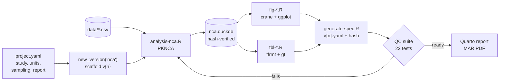
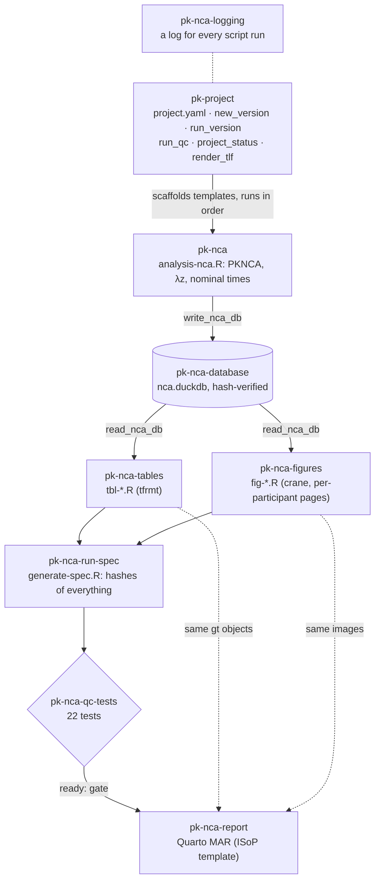
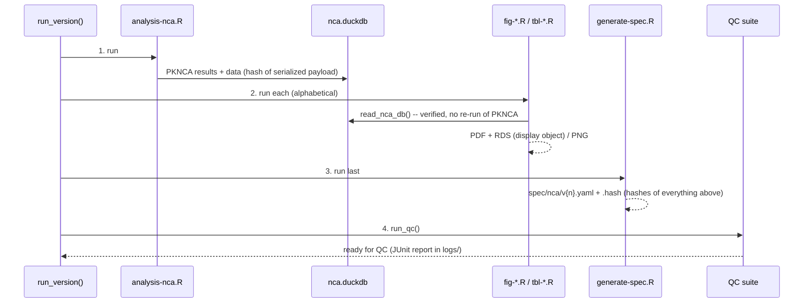
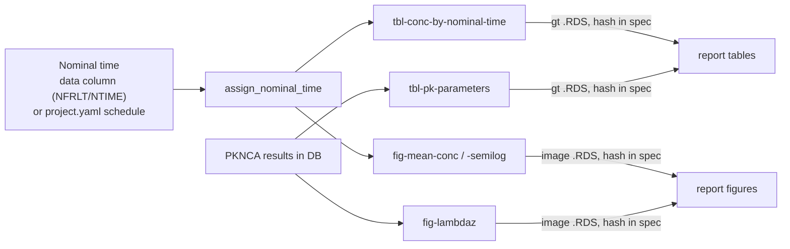

# NCA workflow (`pk-nca-*` skills)

How a noncompartmental analysis (NCA) goes from a dataset to a QC-ready, reportable result
in this template:

- which skills take part;
- what each step produces;
- how provenance and QC tie everything together;
- which prompts to use at each step.

The worked example is `examples/abc-111/`. Its **NCA v3** is built from the current
templates, so every file path below has a real counterpart there.

## At a glance



A version is **ready for QC** when its test suite passes. The report is rendered only from a
version that passed QC and hasn't changed since.

## The skills and how they fit together



| Skill | Role in the NCA workflow | Key entry points |
|---|---|---|
| [`pk-project`](../../.posit/assistant/skills/pk-project/SKILL.md) | Study settings, scaffolding, running, status, the shared table/figure shell | `project_config()`, `new_version()`, `run_version()`, `run_qc()`, `project_status()`, `render_tlf()` |
| [`pk-data-validation`](../../.posit/assistant/skills/pk-data-validation/SKILL.md) | Describes the data file and validates the column mapping (pointblank) before PKNCA runs | `describe_pk_data()`, `validate_pk_data()` |
| [`pk-nca`](../../.posit/assistant/skills/pk-nca/SKILL.md) | The PKNCA pipeline, λz diagnostics, nominal-time rules | `templates/analysis-nca.R`, `scripts/nca_nominal.R` |
| [`pk-nca-database`](../../.posit/assistant/skills/pk-nca-database/SKILL.md) | One DuckDB file per version; results are written once and read everywhere | `write_nca_db()`, `read_nca_db()`, `query_nca_db()` |
| [`pk-nca-tables`](../../.posit/assistant/skills/pk-nca-tables/SKILL.md) | PK-parameter table, concentrations by nominal time | `templates/tbl-*.R` |
| [`pk-nca-figures`](../../.posit/assistant/skills/pk-nca-figures/SKILL.md) | crane mean (SD) profiles; individual and λz regression plots, one page per participant | `templates/fig-*.R` |
| [`pk-nca-logging`](../../.posit/assistant/skills/pk-nca-logging/SKILL.md) | A timestamped log of every script run, plus a session-hygiene check | `nca_log_start()`, `nca_log_stop()` |
| [`pk-nca-run-spec`](../../.posit/assistant/skills/pk-nca-run-spec/SKILL.md) | Provenance record: hashes of scripts, data, database and every output | `templates/generate-spec.R`, `verify_spec()`, `verify_outputs()` |
| [`pk-nca-qc-tests`](../../.posit/assistant/skills/pk-nca-qc-tests/SKILL.md) | Per-version QC-readiness suite | `run_qc_tests()` |
| [`pk-nca-report`](../../.posit/assistant/skills/pk-nca-report/SKILL.md) | Quarto PDF report built from the QC'd results | `create_nca_report()`, `render_nca_report()` |

## Step by step

### 0. Set up the study (once)

Fill in `project.yaml`. Scripts refuse to run while `<...>` placeholders remain:

```yaml
study:    { id: ABC-111, title: ... }
analyses: { nca: { title: PK Analysis for ABC-111 } }
units:    { conc: mg/L, time: h, dose: mg }
sampling:                           # nominal times for tables and mean plots
  nominal_times: [0, 0.25, 0.5, 1, 2, 3.5, 5, 7, 9, 12, 24]
  lloq: 0.1                         # optional; drives BLQ counts and LLOQ lines
report:   { report_number: NCA-001, drug_name: ..., sponsor: ..., authors: ... }
```

Put the dataset in `data/`. Look at it before mapping columns; never guess EVID/CMT coding or
units.

### 1. Scaffold a version

```r
source(".posit/assistant/skills/pk-project/scripts/project.R")
new_version("nca")              # or new_version("nca", from = 2L) to start from v2
```

This creates `script/nca/v{n}/` (10 scripts) and `tests/nca/v{n}/test-nca-qc.R`. Edit only
the blocks marked **EDIT**:

| Script | EDIT block |
|---|---|
| `analysis-nca.R` | data file, column mapping (EVID layout shown), dose route, requested parameters, nominal-time column (`NOMINAL_TIME_COL`, auto-detected) |
| `tbl-pk-parameters.R` | subtitle, display names, `param_digits` (decimals per parameter) |
| `fig-mean-conc*.R` | grouping (e.g. by dose), statistic and variability, `table_times` |
| `fig-lambdaz.R` | span-ratio threshold (default 2) |
| `generate-spec.R` | description, dataset text, diagnostic notes |

### 2. Run it

```r
run_version("nca", 1L)
```

Every script runs in a fresh R session in this order, each writing a log to
`output/nca/v{n}/logs/`:



**Outputs** of one version, from example NCA v3:

| Output | Produced by | Content |
|---|---|---|
| `db/nca.duckdb` | `analysis-nca.R` | concentrations (+ nominal time), doses, all PKNCA results, parameter table, λz fits; serialized R objects with content hash |
| `tables/tbl-pk-parameters.pdf` | pk-nca-tables | individual parameters + N / Mean / Median / Min, Max |
| `tables/tbl-conc-by-nominal-time.pdf` | pk-nca-tables | concentrations by nominal time + N / Mean / Median / Min, Max / BLQ N / %BLQ (4 time columns per page) |
| `figures/fig-mean-conc.pdf` | pk-nca-figures (crane) | mean (SD), linear, real time axis, n / mean / SD table at selected times |
| `figures/fig-mean-conc-semilog.pdf` | pk-nca-figures (crane) | mean (SD), semi-log, LLOQ line |
| `figures/fig-ind-conc.pdf` | pk-nca-figures | one page per participant: linear and semi-log |
| `figures/fig-lambdaz.pdf` | pk-nca-figures | one page per participant: terminal-phase regression, red regression line, fit statistics |
| `figures/fig-halflife-diagnostics.pdf` | pk-nca | terminal-phase fit quality: adjusted R² vs span ratio, all participants |
| `spec/nca/v{n}.yaml` (+ `.hash`) | pk-nca-run-spec | provenance record |
| `logs/*.log`, `logs/qc-tests-*.xml` | every script; QC suite | run history and QC result |

Every table and figure PDF uses the same header and footer (`render_tlf()`):

- **Header:** analysis title, and "Page x of y". Figures add their title and subtitle as
  centred lines below it (tables carry theirs in tfrmt).
- **Footer:** "Source data: `<file>`", the script path, and the render date and time.

### 3. QC

The suite (`tests/nca/v{n}/`) re-checks the version without re-running it:

| Check group | Confirms |
|---|---|
| Structure | the version's scripts exist, each refers only to its own version, and each writes a log |
| Logs | each script's latest run finished without errors |
| Spec | the spec matches its hash file, is complete, and QC status is `pending` or `in_review` |
| Provenance | hashes of scripts, source data, derived data and the database match the spec |
| Outputs | every table and figure (and its `.RDS` object) exists and matches its hash |
| Results | inputs are well-formed; every participant has every parameter; values are plausible; span-ratio flags match |
| Tamper tests | an edited spec, a changed output and a corrupted database are each caught |

`qc.status` stays `pending` until a reviewer signs off; the skills never set it to `approved`.

### 4. Report

```r
source(".posit/assistant/skills/pk-nca-report/scripts/nca_report.R")
create_nca_report(1L)   # output/nca/v1/MAR/: _quarto.yml, index.qmd, sections/, engine/, abbr.tex
render_nca_report(1L)   # refuses unless spec + outputs unchanged and the latest QC run passed
```

One PDF, no narrative chapters:

- **Tables:** every table in the spec, printed from the exact `gt` objects behind the QC'd PDFs.
- **Figures:** every figure and page in the spec, from the exact QC'd images.
- **Source files and provenance:** data, database and spec hashes, QC result, package
  versions, data-validation report, latest run log of each script, file manifest.
- **Code:** the full text of every script, each with its hash checked against the spec.

The report therefore cannot disagree with the QC'd outputs. `report-provenance.yaml` records
what the PDF was built from.

## Consistency and provenance rules



- **Compute once.** Only `analysis-nca.R` runs PKNCA. Everything else reads the database.
- **One nominal-time definition.** Nominal times come from a data column when there is one
  (preferred), otherwise from the `project.yaml` schedule. Tables and mean plots share it,
  so n and mean agree at every timepoint. PK parameters always use actual times.
- **Same rounding.** The figure's summary table rounds like the concentration table (one
  decimal). `param_digits` gives each parameter one precision across its rows.
- **A change means a new version.** For new data, parameters or rules, use
  `new_version("nca", from = n)`. Never edit a version whose spec is under review.
- **Keep the order.** `generate-spec.R` runs last. Re-running any script afterwards makes QC
  fail until the spec is regenerated; `run_version()` enforces this.

## Scenario prompts

Prompts that exercise the workflow end to end. Each names the facts the assistant needs; it
will state anything it has to assume.

### A. New study, first NCA

> *Set up this template for study XYZ-222: study title "Phase 1 SAD of XYZ-222", concentrations in ng/mL, time in h, dose in mg, nominal times 0, 0.5, 1, 2, 4, 8, 12, 24, 48 h, LLOQ 0.5 ng/mL. Then run NCA for `data/xyz222-pk.csv` (oral, AMT is total dose) and tell me if it is ready for QC.*

**What happens:**
1. `project.yaml` is filled in.
2. The data are inspected and `new_version("nca")` scaffolds v1.
3. The data mapping is edited, then `run_version("nca", 1L)` runs everything.
4. You get the key parameters, the flagged λz fits and the QC result.

### B. Data with a nominal-time column (CDISC ADPC)

> *Run NCA for `data/adpc.csv`. Use NRRLT for nominal time (multiple dose, last dose), AVAL for concentration in ng/mL, ARELTM as actual time.*

**What happens:**
1. The column mapping in `analysis-nca.R` is edited, with `NOMINAL_TIME_COL <- "NRRLT"`.
2. The version runs and the spec records "source data column NRRLT".
3. If `project.yaml` also has a schedule, any data value not on it stops the run with a list
   of the values.

### C. Different parameters or rules → new version

> *Starting from NCA v1, also report AUClast, CL/F and Vz/F, show Tmax with 2 decimals, and compare with v1.*

**What happens:**
1. `new_version("nca", from = 1L)` creates v2.
2. The requested parameters and `param_digits` are edited.
3. `run_version()` runs it, and a cross-version query compares v1 and v2:
   `query_nca_db("SELECT project_number, avg(cmax) ... GROUP BY 1")`.

### D. Terminal phase review

> *Show the λz regression for participants with span ratio below 2 in NCA v3 and explain whether their half-life is reliable.*

**What happens:** the relevant pages of `fig-lambdaz.pdf` are shown, with the fit statistics
and the flags from the spec. The explanation covers the sampling window relative to the
half-life, without changing the analysis.

### E. Grouped mean plots

> *In a new NCA version, show the mean concentration plots by dose level, with the summary table at 0, 1, 2, 4, 8, 24 h.*

**What happens:**
1. A new version is created.
2. The grouping EDIT block in both `fig-mean-conc*.R` scripts sets `group` from the dose.
3. `table_times` is set to 0, 1, 2, 4, 8, 24, then the version runs and QC passes.

### F. QC status and review hand-off

> *Which NCA versions are ready for QC? For v3, list what the reviewer should look at.*

**What happens:** `project_status()` lists each version. For v3 you get the spec, the QC
JUnit report, the flagged subjects and the outputs, with their hashes.

### G. Report

> *Create the NCA report for v3 and render it.*

**What happens:**
1. `create_nca_report(3L)` scaffolds the report.
2. `render_nca_report(3L)` checks the version against QC, renders one PDF with its tables,
   figures, source files and code, and returns the PDF path.

### Custom tables and figures

Any table or figure you ask for gets the same shell as the standard outputs:

- **Header:** analysis title and "Page x of y".
- **Footer:** "Source data:", the script path and the date and time.

The assistant scaffolds the output with `new_tlf()`, builds it from the version's database
(never recomputing), registers it in the spec, and re-runs the version so QC covers it.
Tables are tfrmt, like the standard ones. Give these placeholders in the prompt; the
assistant asks for any you leave out:

| Placeholder | Figure | Table |
|---|---|---|
| name | `fig-<short-name>` | `tbl-<short-name>` |
| title | required | required |
| subtitle | optional (population, scale, …) | optional |
| caption / footnotes | a one-line caption | footnotes, separated by `;` |
| content | x, y, grouping, scale | rows, columns, statistics and decimals |

**Prompt template:**

> *Add a [figure / table] to NCA v{n}: name `[fig / tbl]-<short-name>`, title "…", subtitle "…", [caption "…" / footnotes "…"; "…"]. Content: …*

**Figures:**

> *Add a figure to NCA v3: name `fig-cmax-vs-dose`, title "Cmax versus dose", subtitle "Individual values; line: linear regression", caption "Dose is the total administered amount". Content: Cmax (y) vs dose (x), one point per participant, linear fit with 95% band.*

> *Add a figure to NCA v3: name `fig-dn-exposure`, title "Dose-normalized Cmax and AUCinf by participant", subtitle "Dose-normalized to 100 mg", caption "Dashed line: geometric mean". Content: one dot per participant, Cmax/Dose and AUCinf/Dose in two panels.*

> *Add a figure to NCA v3: name `fig-halflife-bar`, title "Terminal half-life by participant", caption "Red: span ratio < 2". Content: one bar per participant ordered by half-life, coloured by the span-ratio flag.*

**Tables:**

> *Add a table to NCA v3: name `tbl-pk-geomean`, title "Summary of PK Parameters (Geometric Statistics)", footnotes "GCV = geometric coefficient of variation"; "Tmax: median (min, max)". Content: rows = Cmax, AUCinf, half-life, Tmax; columns = N, geometric mean (GCV%), median (min, max); 3 significant figures.*

> *Add a table to NCA v3: name `tbl-halflife-summary`, title "Terminal Half-Life Summary", subtitle "By span-ratio category", footnotes "Span ratio = regression interval / half-life"; "N = number of participants". Content: rows = span ratio ≥ 2 and < 2; columns = N, mean half-life, (min, max).*

**What happens**, for example for `tbl-halflife-summary`:

1. `new_tlf("nca", 3L, "tbl-halflife-summary", title = …, subtitle = …, footnotes = c(…))`
   writes `script/nca/v3/tbl-halflife-summary.R` with the placeholders filled in.
2. Its EDIT block is filled from `halflife_fit`: the long ARD
   (`label`, `column`, `param`, `value`) and a tfrmt body plan (`xx` for N, 3 significant
   figures, `frmt_combine("{min}, {max}")`).
3. `run_version("nca", 3L)` runs the version. The spec lists the new PDF with its
   description and hash, and QC covers it.

The NCA database holds concentrations (with nominal time), doses, all PKNCA results,
`res_wide` and the λz fits. It has no covariates, so a figure by weight or age needs those
columns added to the analysis first, as a new version.

### H. Something went wrong

> *QC for NCA v3 fails with "hash mismatch" on fig-mean-conc.pdf. What happened and how do I fix it?*

**What happens:** the figure was re-run after the spec was written. The fix is
`run_version("nca", 3L)` (or re-running `generate-spec.R`), never editing the spec or the
test.

## Where to look

| Question | File |
|---|---|
| What exactly ran, when, by whom? | `output/nca/v{n}/logs/*.log` |
| What did this version use and produce? | `spec/nca/v{n}.yaml` |
| Did it pass QC? | `output/nca/v{n}/logs/qc-tests-*.xml`, or `project_status()` |
| Numbers for my own summary | `query_nca_db("SELECT * FROM nca_res_wide")` |
| What was the report built from? | `output/nca/v{n}/MAR/report-provenance.yaml` |
| How does one skill work in detail? | [Skill pages](../skills/README.md): [`pk-nca`](../skills/pk-nca.md), [`pk-nca-tables`](../skills/pk-nca-tables.md), [`pk-nca-figures`](../skills/pk-nca-figures.md), [`pk-nca-report`](../skills/pk-nca-report.md), ... |
