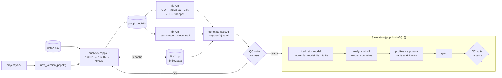
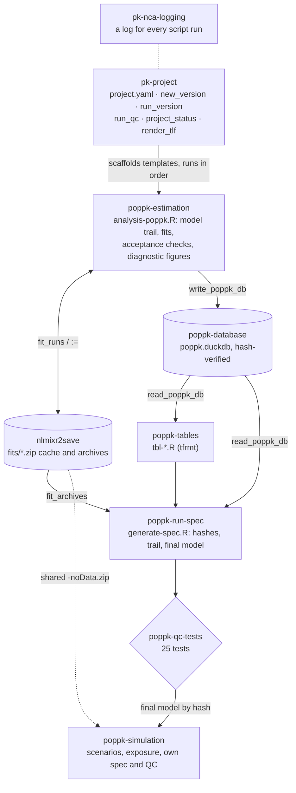
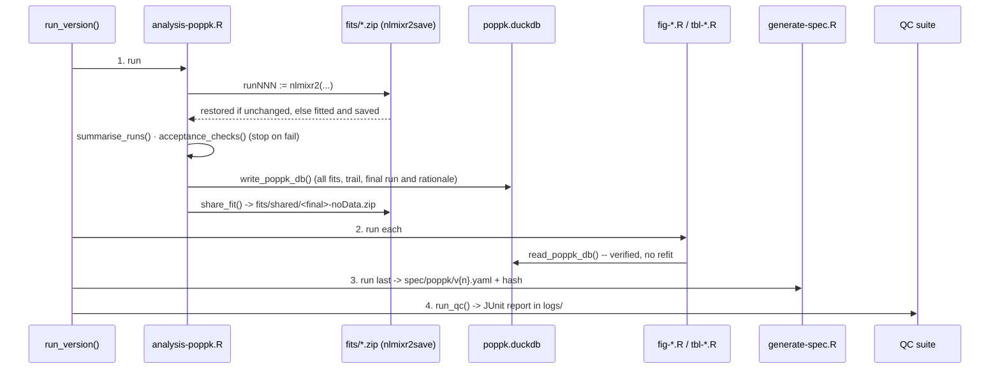
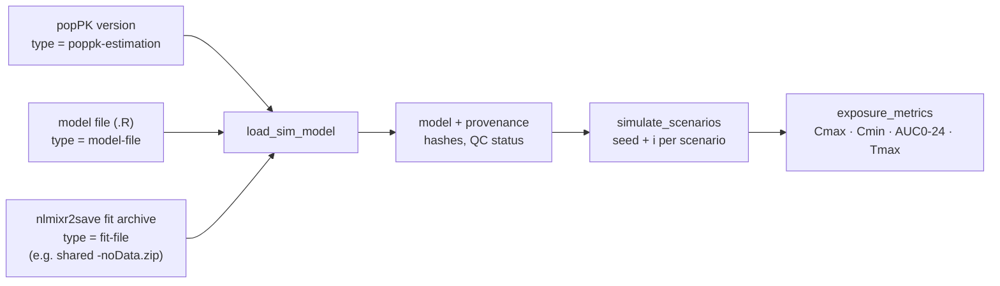

# Population PK workflow (`poppk-*` skills)

This guide covers how a population PK (popPK) analysis moves through the template:

1. **Estimation:** a model-building trail of nlmixr2 fits → the final model → diagnostics and
   tables → provenance → QC.
2. **Simulation:** rxode2 exposure scenarios, starting from the final model (or from a model
   or fit file) → provenance → QC.

It also covers which skills take part, what each step produces, how `nlmixr2save` caches and
archives the fits, and which prompts to use.

The worked example is `examples/abc-111/`. Its **popPK v2** and **simulation v2** are built from
the current templates, so every path below has a real counterpart there (v1 of each predates
the templates).

## At a glance



Each popPK version is QC-ready when its suite passes. Simulations reference a popPK version
by the hash of its database, so refitting that version later makes the simulation's QC fail
until the simulation is re-run.

## The skills and how they fit together



| Skill | Role in the popPK workflow | Key entry points |
|---|---|---|
| [`pk-project`](../../.posit/assistant/skills/pk-project/SKILL.md) | Study settings, scaffolding, running, status, the shared table/figure shell | `new_version("poppk")`, `run_version()`, `run_qc()`, `project_status()`, `render_tlf()` |
| [`poppk-estimation`](../../.posit/assistant/skills/poppk-estimation/SKILL.md) | Model trail, fitting (with the `nlmixr2save` cache), acceptance checks, diagnostic figures | `templates/analysis-poppk.R`, `fit_runs()`, `summarise_runs()`, `acceptance_checks()`, `templates/fig-*.R` |
| [`poppk-database`](../../.posit/assistant/skills/poppk-database/SKILL.md) | All fits of a version in one DuckDB file; results are written once and read everywhere | `write_poppk_db()`, `read_poppk_db()`, `query_poppk_db()` |
| [`poppk-tables`](../../.posit/assistant/skills/poppk-tables/SKILL.md) | Final-model parameter table and model-development table (tfrmt) | `templates/tbl-*.R` |
| [`poppk-run-spec`](../../.posit/assistant/skills/poppk-run-spec/SKILL.md) | Provenance: hashes of scripts, data, database, fit archives and outputs; the trail; the final model and its rationale | `templates/generate-spec.R` |
| [`poppk-qc-tests`](../../.posit/assistant/skills/poppk-qc-tests/SKILL.md) | Per-version QC-readiness suite | `run_poppk_qc_tests()` |
| [`poppk-simulation`](../../.posit/assistant/skills/poppk-simulation/SKILL.md) | rxode2 simulation of dosing scenarios, exposure metrics, its own spec and QC | `load_sim_model()`, `simulate_scenarios()`, `exposure_metrics()` |
| [`pk-nca-logging`](../../.posit/assistant/skills/pk-nca-logging/SKILL.md) | A timestamped log of every script run (`output_dir = "output/poppk"`) | `nca_log_start()`, `nca_log_stop()` |

## Part 1: Estimation

### 0. Set up the study (once)

`project.yaml` holds the study ID, analysis titles and units, which popPK uses for labels
and headers:

```yaml
study:    { id: ABC-111, title: ... }
analyses: { poppk: { title: PopPK Analysis for ABC-111 }, poppk-sim: { title: PopPK Simulation for ABC-111 } }
units:    { conc: mg/L, time: h, dose: mg }
```

The dataset in `data/` is NONMEM-style: `ID`, `TIME`, `DV`, `AMT`, `EVID`, `CMT`, plus
covariates. Check the EVID/CMT coding and the covariate columns before writing a model.

### 1. Scaffold a version

```r
source(".posit/assistant/skills/pk-project/scripts/project.R")
new_version("poppk")              # or new_version("poppk", from = 1L) to continue v1's trail
```

This creates `script/poppk/v{n}/` (9 scripts) and `tests/poppk/v{n}/test-poppk-qc.R`. Edit
the **EDIT** blocks:

| Script | EDIT block |
|---|---|
| `analysis-poppk.R` | data file and checks; the model trail (`run001` is the base model, each child is a piped edit of its parent) and `run_info`; the estimation method; `final_run` and `final_rationale` |
| `fig-individual-fits.R` | how many worst-fitting participants to flag |
| `fig-eta.R` | covariates to plot against the ETAs (default: every baseline numeric covariate) |
| `fig-vpc.R` | which VPC types (standard, prediction-corrected, dose-normalized), x-axes (time after first dose, time after dose) and y-scales (linear, log); replicates, binning, seed |
| `tbl-parameters.R` | title and subtitle |
| `generate-spec.R` | description, dataset text, notes |

The model trail builds up one change per run:

```r
run001 <- function() { ini({ ... }); model({ ... }) }            # base model
run002 <- run001 |>                                               # one change per run
  model(cl <- exp(tcl + eta.cl + wt_cl * log(WT / 70))) |>
  ini(wt_cl <- 0.75)
run_info <- tribble(~run_id, ~parent_run, ~description,
  "run001", NA, "1-cmt, first-order absorption",
  "run002", "run001", "run001 + WT on CL/F")
final_run <- "run001"
final_rationale <- "WT effect not supported (dOFV = -0.62 for 1 parameter)"
```

### 2. Run it

```r
run_version("poppk", 1L)
```



#### Fit cache and archives (`nlmixr2save`)

- **Cache:** each run is fitted with nlmixr2save's `:=` and saved as
  `output/poppk/v{n}/fits/runNNN.zip`. Re-running the version while you build the model
  **restores unchanged runs instead of refitting them**; the log says "restored from cache
  (unchanged)". Changing the model, method, options or estimation data refits that run.
- **Archive:** the same zips are portable fit archives (R + CSV, recording the nlmixr2est and
  rxode2 versions), readable independently of the database. The spec records their hashes
  and QC reloads the final one.
- **Shareable copy:** `fits/shared/<final_run>-noData.zip` is the final fit without subject
  data, for sharing outside the project. It can still be simulated.
- **Refitting:** to force a refit, delete `fits/<run>.zip`.

#### Outputs

All tables and figures render in the same shell as the NCA outputs:

- **Header:** analysis title and "Page x of y".
- **Footer:** "Source data:", the script path and the date and time.

They cover the diagnostics checklist in `poppk-estimation/references/diagnostics.md`:

| Output | Checklist item | Content |
|---|---|---|
| `figures/fig-gof.pdf` | 1 Structure, 2 Residuals | page 1 linear: DV vs PRED/IPRED, CWRES vs time/PRED (±2, ±3 lines); page 2: log-log DV vs PRED/IPRED, CWRES QQ, \|IWRES\| vs IPRED |
| `figures/fig-individual-fits.pdf` | 3 Individuals | one page per participant, linear and semi-log, ETAs in the caption, worst-fitting flagged |
| `figures/fig-eta.pdf` | 4 Random effects | ETA histograms and QQ plots with shrinkage; ETA vs baseline covariates |
| `figures/fig-vpc.pdf` | 5 Predictive check | collection of VPCs, one per page: standard, prediction-corrected, dose-normalized × time after first dose / time after dose × linear / log y |
| `figures/fig-traceplot.pdf` | 6 Convergence | parameter history by iteration |
| `figures/fig-model-diagram.pdf` | Model structure | compartment diagram of the final model from its equations (nlmixr2plot `modelDiagram()`), arrows labelled with the model terms |
| `figures/fig-pmx-diagnostics.pdf` | 2, 4 Residuals, random effects | ggPMX: NPDE vs time / PRED / QQ, IWRES distribution, random-effect correlations, random effects by categorical covariate |
| `tables/tbl-parameters.pdf` | — | back-transformed estimates (3 s.f.), %RSE, 95% CI, BSV, shrinkage; Structural / Residual |
| `tables/tbl-model-comparison.pdf` | — | the trail: N par, OFV, dOFV, AIC, BIC, covariance step; `*` = final |
| `fits/*.zip`, `fits/shared/*-noData.zip` | — | nlmixr2save cache and archives; shareable final fit |
| `db/poppk.duckdb`, `spec/poppk/v{n}.yaml`, `logs/` | — | results, provenance, run history and QC reports |

#### Acceptance checks

`analysis-poppk.R` stops if the final model fails any of these:

- **Fail** (blocks reporting and QC):
  - OFV not finite;
  - covariance step failed;
  - a structural SE missing;
  - a THETA on its bound;
  - residual error ≤ 0.
- **Warn** (recorded as caveats in the spec):
  - structural %RSE > 50;
  - ETA shrinkage > 30%;
  - BSV CV% outside 1–100%.

### 3. QC

| Check group | Confirms |
|---|---|
| Structure and logs | the version's scripts exist, each refers only to its own version, and every run finished without errors |
| Spec | the spec matches its hash file and is complete (final run, rationale); QC status is `pending` or `in_review` |
| Provenance | hashes of scripts, source data, model dataset and database match the spec |
| Outputs | every table and figure (and its `.RDS` object) exists and matches its hash |
| Model trail | the spec's runs match the stored fits (OFV, model-code hash, dOFV); there is exactly one final model |
| Final model | the fit used every participant and observation; acceptance checks pass; caveats match a recomputation |
| Fit archives | every run's archive matches its hash; the final archive reloads with the same OFV and estimates; the shared copy has no subject data |
| Tamper tests | an edited spec, a changed output and a corrupted database are each caught |

## Part 2: Simulation

### Choose the model source



| Source | `sim_source` | Parameter uncertainty |
|---|---|---|
| A fitted popPK version | `list(type = "poppk-estimation", poppk_version = 1L)` (optional `run_id`) | automatic with `nStud > 1` (fit covariance) |
| A model file | `list(type = "model-file", path = "model/<name>.R")` | via `prior()` or `thetaMat` only |
| An nlmixr2save fit archive | `list(type = "fit-file", path = "model/<run>-noData.zip")` | automatic when the archive has a covariance |

### Scaffold, edit, run

```r
new_version("poppk-sim")      # script/poppk-sim/v{m}/ (5 scripts) + tests
# EDIT analysis-sim.R: sim_source, scenarios (one et() per regimen), steady-state windows,
#                      nSub / nStud / seed, and optionally CACHE_SIMS <- TRUE
run_version("poppk-sim", 1L)
```

The outputs are `fig-sim-profiles.pdf` (median and 90% PI per regimen), `fig-exposure.pdf`
and `tbl-exposure-summary.pdf` (steady-state Cmax, Cmin, AUC0-24 and Tmax per regimen).

The spec records:

- **the source:** the popPK database hash and spec QC status, or the file hash;
- **the settings:** seed, nSub and nStud;
- **each scenario:** its events hash;
- **caveats:** for example, a source whose QC isn't approved yet, or an external fit file.

**Optional simulation cache.** For long simulations, set `CACHE_SIMS <- TRUE`. nlmixr2save's
seed-aware `:=` then saves `cache/sims.rds` and restores it when the model content,
scenarios, settings and seed are unchanged.

### Simulation QC (21 tests)

On top of the structure, log, spec, provenance and output checks, the suite confirms:

- **Source unchanged:** the model source is unchanged since the simulation (the popPK
  database and spec hashes, or the file hash).
- **Metrics re-derive:** exposure metrics recompute from the stored simulations.
- **Reproducible:** re-simulating the first scenario from its recorded seed gives exactly
  the stored rows.

## Consistency and provenance rules

- **Compute once.** Only `analysis-poppk.R` fits, and only `analysis-sim.R` simulates.
  Figures, tables and specs read the database (and the fit archives) and never refit.
- **The same OFV across the trail.** Use the same method for every run. SAEM with
  `tableControl(cwres = TRUE, npde = TRUE)` gives the FOCEi OFV for each run, so ΔOFV is valid, and stores NPDE for the ggPMX diagnostics.
- **A change means a new version.** A different data set, trail or method gets
  `new_version("poppk", from = n)`. The nlmixr2save cache is per version (`fits/` sits under
  `output/poppk/v{n}/`), so a new version fits fresh.
- **Simulations follow their source.** A simulation records the popPK database hash and spec
  hash. Refitting that popPK version, or regenerating its spec, fails the simulation's QC
  until the simulation is re-run.
- **Reproducible randomness.** SAEM, VPC and simulations all use fixed seeds. Data are read
  with `read_csv(..., lazy = FALSE) |> as.data.frame()` so the data hash is stable.

## Scenario prompts

Each prompt names the facts the assistant needs. The assistant states anything it had to
assume.

### A. First popPK model

> *Develop a popPK model for `data/xyz222-pk.csv` (oral, AMT total mg, concentrations ng/mL, time h). Start with a one-compartment model with first-order absorption and additive error, use SAEM, and tell me whether the final model passes the acceptance checks and QC.*

**What happens:**
1. The data are inspected (EVID/CMT, covariates) and `new_version("poppk")` scaffolds the
   version.
2. `run001` is written and `run_version()` runs everything.
3. You get the estimates, the ΔOFV trail, acceptance-check warnings and the QC result.

### B. Build the model up, cheaply

> *In popPK v1, add a combined residual error model as run002 and a lag time as run003, compare them to run001, and pick the final model.*

**What happens:**
1. Two child runs are added to `models` and `run_info`, and the version is re-run.
2. **run001 is restored from the nlmixr2save cache**; only run002 and run003 are fitted.
3. The ΔOFV trail and diagnostics decide the final model, with `final_rationale` stated.
   If the version's spec is already under review, this is `new_version("poppk", from = 1L)`
   instead.

### C. Covariate model as a new version

> *Starting from popPK v1, test body weight on CL/F and V/F (power model centred at 70 kg) one at a time, with ΔOFV < −3.84 for inclusion.*

**What happens:** `new_version("poppk", from = 1L)` creates the new version, one run per
covariate is added, and the ETA-vs-covariate page of `fig-eta.pdf` and the model-comparison
table support the decision.

### D. Diagnostics review

> *Review the diagnostics of popPK v2 against the checklist: which participants fit worst, is shrinkage a concern, and does the VPC support the model?*

**What happens:** the relevant pages of `fig-gof.pdf`, `fig-individual-fits.pdf` (worst-
fitting flagged), `fig-eta.pdf`, `fig-vpc.pdf` and `fig-traceplot.pdf` are summarised, with
the acceptance-check caveats from the spec.

### E. Share the model without the data

> *Give me a copy of the popPK v1 final model I can send to a partner without any subject data.*

**What happens:** the path `output/poppk/v1/fits/shared/<final_run>-noData.zip`. It contains
the estimates, OMEGA and covariance, and no `origData`.

### F. Regimen simulation from our model

> *Using the popPK v1 final model, simulate 320 mg q12h, 480 mg q12h and 640 mg q24h for 7 days, 100 subjects × 10 studies, and compare steady-state Cmax, Cmin and AUC0-24.*

**What happens:** `new_version("poppk-sim")` with source `poppk-estimation` and three `et()`
scenarios is created and run. The exposure table is quoted, with a caveat if popPK v1 isn't
QC-approved.

### G. Simulation from a partner's fit

> *We received `model/partner-fit-noData.zip` (an nlmixr2save fit). Simulate 200 mg q24h for 14 days with parameter uncertainty.*

**What happens:** the simulation uses source `fit-file`. Provenance records the file hash and
whether the archive carries a covariance. The spec adds a `fit_file_source` caveat.

### H. Long simulation, re-run cheaply

> *Re-run simulation v2 with the cache on; I only changed the table titles.*

**What happens:** `CACHE_SIMS <- TRUE`, so the simulations are restored from `cache/sims.rds`
and only the outputs are regenerated.

### Custom tables and figures

Any table or figure you ask for gets the same shell as the standard outputs:

- **Header:** analysis title and "Page x of y".
- **Footer:** "Source data:", the script path and the date and time.

The assistant scaffolds the output with `new_tlf()`, builds it from the version's database
(never recomputing), registers it in the spec, and re-runs the version so QC covers it.
Tables are tfrmt, like the standard ones. Give these placeholders in the prompt; the
assistant asks for any you leave out:

| Placeholder | Figure | Table |
|---|---|---|
| name | `fig-<short-name>` | `tbl-<short-name>` |
| title | required | required |
| subtitle | optional (population, scale, …) | optional |
| caption / footnotes | a one-line caption | footnotes, separated by `;` |
| content | x, y, grouping, scale | rows, columns, statistics and decimals |

**Prompt template:**

> *Add a [figure / table] to popPK (or simulation) v{n}: name `[fig / tbl]-<short-name>`, title "…", subtitle "…", [caption "…" / footnotes "…"; "…"]. Content: …*

**Figures:**

> *Add a figure to popPK v2: name `fig-ebe-wt`, title "Individual CL/F and V/F versus body weight", subtitle "Empirical Bayes estimates, final model", caption "Red: loess smooth". Content: individual CL/F and V/F from the final fit vs WT, two panels, log y-axis.*

> *Add a figure to popPK v2: name `fig-param-forest`, title "Final-model parameter estimates with 95% CI". Content: one row per structural parameter, back-transformed estimate and CI, log x-axis.*

> *Add a figure to simulation v2: name `fig-cmin-target`, title "Probability of Cmin,ss above 5 mg/L by regimen", caption "Across all simulated subjects and studies". Content: bar per regimen, percentage of subjects with Cmin,ss ≥ 5 mg/L.*

**Tables:**

> *Add a table to popPK v2: name `tbl-ebe-individual`, title "Individual PK Parameters (Empirical Bayes Estimates)", footnotes "Final model run001"; "Min, Max = minimum and maximum". Content: rows = participants plus N / Mean / Median / Min, Max; columns = Ka, CL/F, V/F; 3 significant figures.*

> *Add a table to popPK v2: name `tbl-eta-summary`, title "ETA Shrinkage and BSV by Parameter", footnotes "BSV = between-subject variability"; "Shrinkage on the SD scale". Content: rows = ETAs; columns = OMEGA variance, BSV (CV%), shrinkage (%).*

**What happens**, for example for `tbl-ebe-individual`:

1. `new_tlf("poppk", 2L, "tbl-ebe-individual", title = …, footnotes = c(…))` writes
   `script/poppk/v2/tbl-ebe-individual.R` with the placeholders filled in.
2. Its EDIT block builds the ARD from the final fit's individual parameters
   (`as.data.frame(fit)`: `ka`, `cl`, `v` per ID) and the summary rows, with a tfrmt body
   plan. No refit.
3. `run_version("poppk", 2L)` runs the version. The fit cache restores the runs, the new
   table is rendered, and the spec and QC include it.

Available objects:

- **popPK:** `fit` (final model: `as.data.frame(fit)`, `fit$eta`, `fit$parFixedDf`,
  `fit$shrink`, `fit$omega`), `fits` (every run), `runs` (the trail), `pkData`.
- **Simulation:** `sims`, `metrics`, `exposure_summary`, `profiles`, `settings`,
  `scenario_info`.

### I. Something went wrong

> *QC for simulation v1 fails with "model source is unchanged since the simulation". Why?*

**What happens:** the source popPK version was refit or its spec regenerated after the
simulation ran. The fix is to re-run the simulation (a new version if it is already under
review), never to edit the spec.

## Where to look

| Question | File |
|---|---|
| What ran, and was a fit restored or refitted? | `output/poppk/v{n}/logs/analysis-poppk-*.log` |
| Trail, final model, rationale, caveats, hashes | `spec/poppk/v{n}.yaml` |
| A fit outside this project | `output/poppk/v{n}/fits/<run>.zip` (`load_fit_archive()`) or `fits/shared/*-noData.zip` |
| Did it pass QC? | `output/poppk/v{n}/logs/qc-tests-*.xml`, or `project_status()` |
| Numbers across versions | `query_poppk_db("SELECT project_number, run_id, objf, delta_ofv FROM poppk_runs")` |
| Where did a simulation's model come from? | `spec/poppk-sim/v{m}.yaml` → `source:` |
| How does one skill work in detail? | [Skill pages](../skills/README.md): [`poppk-estimation`](../skills/poppk-estimation.md), [`poppk-tables`](../skills/poppk-tables.md), [`poppk-simulation`](../skills/poppk-simulation.md), ... |
