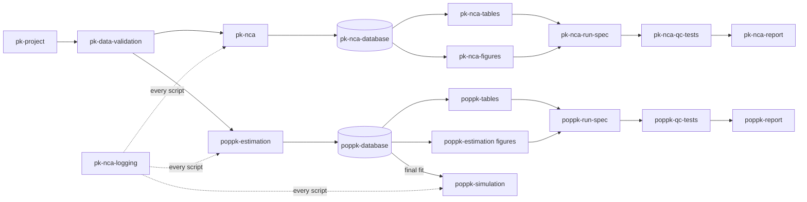

# Skills reference

One page per skill: what it does, when the assistant uses it, what it produces, how to use it,
its main functions and files, its rules and checks, and troubleshooting. Each page links to
the skill's `SKILL.md` (the instructions the assistant follows) and to the workflow guide.

For the end-to-end workflows start with the [NCA guide](../pk-nca/README.md) or the
[popPK guide](../poppk/README.md). For the rules every assistant follows, see
[AGENTS.md](../../AGENTS.md).

## Project and data

| Skill | Purpose |
|---|---|
| [`pk-project`](pk-project.md) | Entry point: `project.yaml`, scaffolding versions from templates, running them in order, QC status, the shared table and figure shell |
| [`pk-data-validation`](pk-data-validation.md) | Describe a dataset for column mapping, then validate it with pointblank before any analysis |
| [`pk-nca-logging`](pk-nca-logging.md) | Timestamped run log of every script (NCA, popPK, simulation) with a run summary, and a session check |

## Noncompartmental analysis

| Skill | Purpose |
|---|---|
| [`pk-nca`](pk-nca.md) | The PKNCA pipeline: data to `PKNCAconc`/`PKNCAdose`, parameters, terminal-phase checks |
| [`pk-nca-database`](pk-nca-database.md) | Stores a version's NCA results in DuckDB, verified by hash, for every table, figure and report |
| [`pk-nca-tables`](pk-nca-tables.md) | PK parameter table and concentrations by nominal time (tfrmt + docorator) |
| [`pk-nca-figures`](pk-nca-figures.md) | Mean and individual concentration plots, terminal-phase regression plots, half-life diagnostics |
| [`pk-nca-run-spec`](pk-nca-run-spec.md) | The version's provenance record: hashes of scripts, data, database and outputs |
| [`pk-nca-qc-tests`](pk-nca-qc-tests.md) | The per-version QC-readiness test suite |
| [`pk-nca-report`](pk-nca-report.md) | One PDF of a QC'd version: tables, figures, source files and provenance, code |

## Population PK

| Skill | Purpose |
|---|---|
| [`poppk-estimation`](poppk-estimation.md) | nlmixr2 model trail, estimation, acceptance checks and diagnostic figures (GOF, VPCs, ggPMX, model diagram) |
| [`poppk-database`](poppk-database.md) | Stores every fit of a version in DuckDB for tables, figures and QC |
| [`poppk-tables`](poppk-tables.md) | Parameter table (fixed, random, residual; checked against model and data) and model-development table |
| [`poppk-run-spec`](poppk-run-spec.md) | Provenance record: model trail, final model and rationale, hashes |
| [`poppk-qc-tests`](poppk-qc-tests.md) | The per-version QC-readiness test suite |
| [`poppk-report`](poppk-report.md) | One PDF of a QC'd version: tables, figures, model trail and final model, provenance, code |

## Simulation

| Skill | Purpose |
|---|---|
| [`poppk-simulation`](poppk-simulation.md) | rxode2 simulation from a popPK fit or a model file: regimens, exposure metrics, its own database, spec and QC |

## Maintaining the skills

| Skill | Purpose |
|---|---|
| [`manage-skills`](manage-skills.md) | Maintains the skills themselves: add, change, rename, retire and check the skills; `check_skills.R` checks frontmatter, paths, code and registration |

## How the skills fit together

Every version follows the same order, which `run_version()` enforces: analysis script, then
figures and tables, then `generate-spec.R`, then the QC suite.
